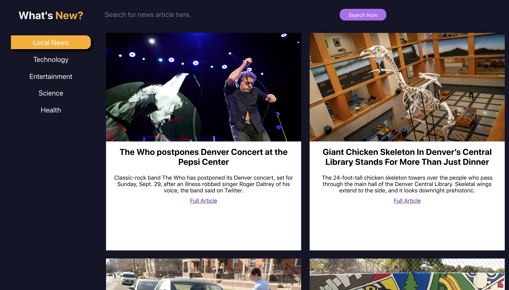
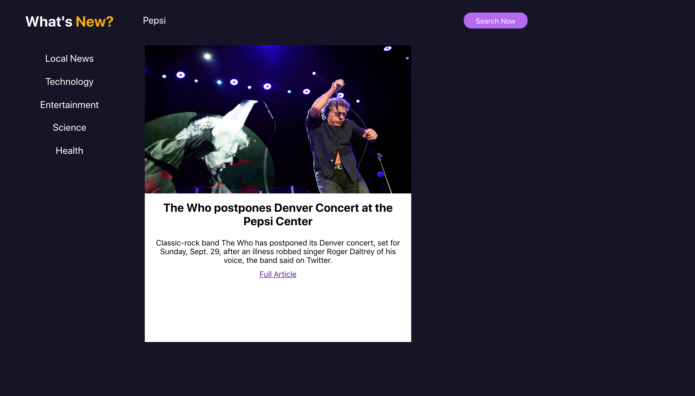

# Whats New

The Whats New project is my first solo project during Mod 3 at Turing School of Software & Design. The project is an example news site complete with articles, category tabs, and a search bar. It is my first project built using react and it is designed tp deepen my understanding of writing clean code using ES6 syntax, passing information between components using props, writing clean and simple JSX, and using unit test React components including snapshot testing, methods, and changes in state. Repository can be found <a href="https://github.com/SamuelColeman/whats-new">here</a> and the project specs can be found <a href="https://frontend.turing.io/projects/whats-new.html">here</a>.

## Built with:

* HTML5
* CSS3
* SASS
* JavaScript
* React/JSX
* Snapshot/Enzyme/Jest

## Contributors

[Sam Coleman](https://github.com/SamuelColeman)

## Screenshots

